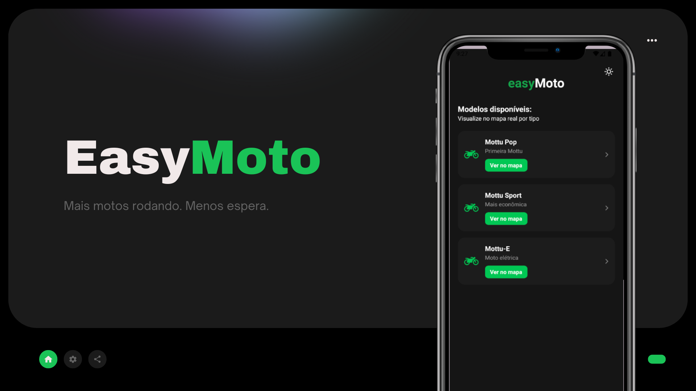

# easyMoto Mobile — Sprint 4 (Mobile) 📱

<p align="center">
  
</p>

Aplicativo mobile **React Native + Expo (TypeScript)** para gestão de motos, pátio e operação de locação.
Integra com backend **.NET/C#** (CRUD completo de **motos** e **usuários**).

**Backend (Swagger):** http://74.249.100.243/swagger/index.html?urls.primaryName=EasyMoto.Api+v2   
**Api-Key:** `super-secret-key` <br>
**Package (Android):** `com.easymoto.fiap`

---

## 🔗 Links da Sprint
- 🎬 **Link do vídeo:** [https://www.youtube.com/watch?v=FL7-uC8fDTk] 
- 📦 **Link do APK:** [https://expo.dev/accounts/akemisky/projects/EasyMotoTS/builds/6d61b90b-e09c-491a-8813-25b40b825d69] 

> Observação: o APK foi distribuído via **Firebase App Distribution**. Para instalar, o tester precisa aceitar o convite e permitir **instalar apps de fontes desconhecidas** no Android.

---

## ✨ Funcionalidades principais
- Autenticação com `AsyncStorage` (token JWT em `Authorization`).
- Cadastro, edição e exclusão de **motos** (placa, modelo, ano, tipo, status, legenda).
- Visualização do **pátio** com ícones/cores conforme legenda.
- **Notificações** padronizadas (ex.: `Operador: NOME Cadastrou a moto: PLACA MODELO`).
- **Relatórios** por status (gráfico de barras).
- **Tela SobreApp** com dados de versão (commit/date).

---

## ☕️ Stack
- **React Native (Expo)** + **TypeScript**
- **Navegação:** `@react-navigation/native`, Stack e Bottom Tabs
- **HTTP:** `axios`
- **Storage:** `@react-native-async-storage/async-storage`
- **Gráficos:** `react-native-chart-kit` 
- **UI extra:** `react-native-paper`, `expo-linear-gradient`, `@expo/vector-icons`
- **i18n:** `expo-localization`
- **Push:** `expo-notifications`
- **Qualidade:** ESLint v9 (flat) + Prettier

---

## 🔧 Como rodar (dev)
1. **Pré-requisitos**
   - Node LTS (18+ recomendado), NPM, Expo Go (ou emulador Android).

2. **Instale dependências**
```bash
npm install
```

3. **Configurar API**
- Em `src/services/api.ts`, ajuste a `baseURL` para o backend (ex.: `http://74.249.100.243`).

4. **Executar**
```bash
npm run start

```

---

## 🧪 Fluxo de teste (backend + app)
- **Swagger:** http://74.249.100.243/swagger/index.html?urls.primaryName=EasyMoto.Api+v2  
- Para **criar um usuário**, utilize a **filial `01001-000`**.  
- Para acessar a **tela “Sobre o App”**, é necessário **usuário com perfil de administrador**.

---

## 👥 Equipe
- ⭐️ **Valéria Conceição Dos Santos** — RM: **557177**  
- ⭐️ **Mirela Pinheiro Silva Rodrigues** — RM: **558191**

---
